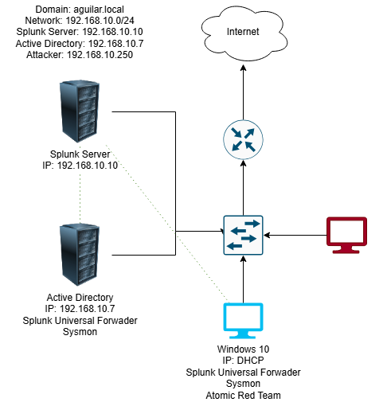
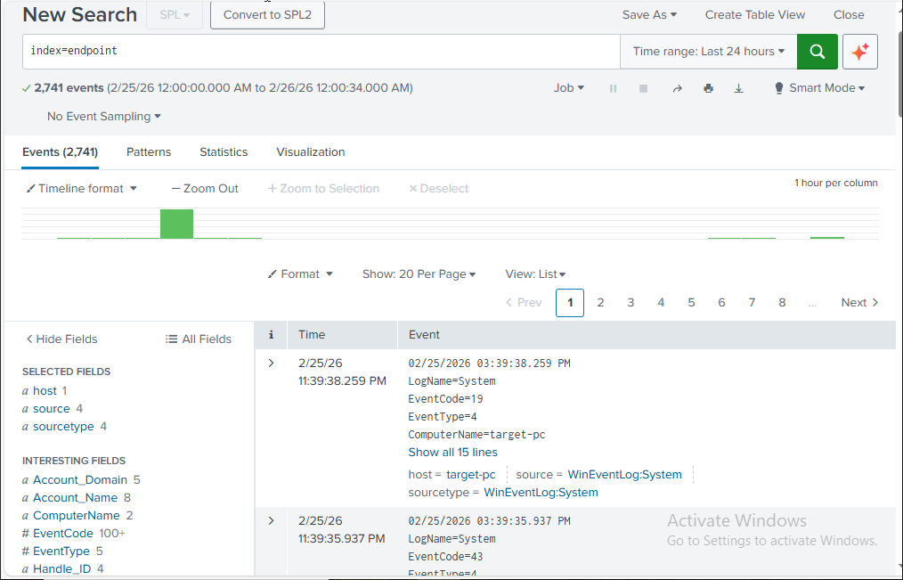

# Active Directory Homelab

A hands-on cybersecurity homelab simulating a small enterprise environment with Active Directory, centralized logging via Splunk, and attack simulation using Kali Linux.

---

## 📐 Network Diagram

[](Active_Directory_Homelab_Diagram.drawio)

---

## 🖥️ Lab Environment

| Machine | Role | IP Address | OS |
|---|---|---|---|
| Splunk Server | Log aggregation & SIEM | 192.168.10.10 | Ubuntu Server |
| Active Directory | Domain Controller | 192.168.10.7 | Windows Server 2022 |
| Target PC | Endpoint (domain-joined) | 192.168.10.x | Windows 10 |
| Kali Linux | Attacker machine | 192.168.10.250 | Kali Linux |

---

## 🛠️ Tools & Technologies

- **Active Directory Domain Services (AD DS)** — Domain controller managing users, groups, and policies
- **Splunk** — SIEM platform for log ingestion, searching, and alerting
- **Splunk Universal Forwarder** — Installed on the AD server to forward Windows Event Logs to Splunk
- **Sysmon** — System Monitor for detailed endpoint telemetry (process creation, network connections, etc.)
- **Kali Linux** — Used for simulating attacks (brute force, enumeration, etc.)

---

## 🔧 Setup Overview

### 1. Network Configuration
- All machines on a NAT network: `192.168.10.0/24`
- Kali Linux used as the attack machine from within the same subnet

### 2. Active Directory Setup
- Promoted Windows Server to Domain Controller
- Created Organizational Units (OUs), users, and groups
- Joined the Windows 10 target machine to the domain

### 3. Splunk Configuration
- Deployed Splunk on Ubuntu Server (`192.168.10.10`)
- Installed **Splunk Universal Forwarder** on the AD server
- Configured `inputs.conf` to collect Windows Event Logs and Sysmon logs
- Set up the `endpoint` index to receive forwarded logs

### 4. Sysmon Installation
- Installed Sysmon on the AD/Windows machines using the [Olaf Hartong config](https://github.com/olafhartong/sysmon-modular)
- Provides enriched telemetry for detections

### 5. Attack Simulation (Kali Linux)
- Ran brute force attacks against domain accounts using **Crowbar** / **Hydra**
- Performed enumeration with tools like **nmap** and **BloodHound**

---

## 🔍 Splunk Detection

Logs are queryable via the `endpoint` index in Splunk:

```spl
index=endpoint
```



### Example Searches

```spl
# Failed login attempts (Event ID 4625)
index=endpoint EventCode=4625

# Successful logins (Event ID 4624)
index=endpoint EventCode=4624

# New process creation via Sysmon (Event ID 1)
index=endpoint source="XmlWinEventLog:Microsoft-Windows-Sysmon/Operational" EventCode=1

# Brute force detection — multiple failures from same source
index=endpoint EventCode=4625
| stats count by src_ip, Account_Name
| where count > 10
```

---

## 📁 Repository Structure
